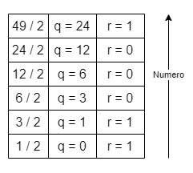

# Architettura degli elaboratori I

## 1 Sistema posizionale

> [!IMPORTANT] Sistema posizionale
>
> Ogni simbolo ha un proprio **valore** (peso) che dipende dalla **posizione** in cui si trova all'interno di un numero.

## 2 Basi più utilizzate

La rappresentazione più importante è quella **binaria**, ma vedremo anche la base ottale, decimale ed esadecimale.

### 2.1 Base binaria

Cifre utilizzate: $\{ 0, 1 \}$.

Formula generale: $b_{n}*2^{n-1}+b_{n-1}*2^{n-2}+ \dots +b_{n}*2^{0}$

Ad esempio: $11001_{(2)} = 1 * 2^{4}+1 * 2^{3}+0 * 2^{2}+0 * 2^{1}+1 * 2^{0} = 25_{(10)}$

### 2.2 Base ottale

Cifre utilizzate: $\{0,1,2,3,4,5,6,7\}$.

Formula generale: $b_{n} * 8^{n-1}+b_{n-1} * 8^{n-2}+\dots +b_{n} * 8^{0}$

Ad esempio: $51_{(8)}=5 * 8^{1}+1 * 8^{0}=41_{(10)}$

### 2.3 Base decimale

Cifre utilizzate: $\{ 0,1,2,3,4,5,6,7,8,9 \}$.

Formula generale: $V(N_{(r)})= \sum_{i} ^ {n-1}  = -m^{r^{i}d_{I}}$ #issue sulla sommatoria

Ad esempio: $210_{(10)}=2 * 10^{2}+1 * 10+0 * 10^{0}$

### 2.4 Base esadecimale

Cifre utilizzate: $\{ 0,1,2,3,4,5,6,7,8,9,A,B,C,D,E,F \}$.

Formula generale: $b_{n} * 16^{n-1}+b_{n-1} * 16^{n-2}+ \dots +b_{n} * 16^{0}$

Ad esempio: $5A_{(16)}=5 * 16^{1}+A * 16^{0}=5 * 16+10 * 1=90_{(10)}$

### 2.5 Conversioni

La conversione è un procedimento che ci permette di trasformare un valore da una base all’altra.

Questo ci permette così di tradurre il linguaggio ad alto livello in linguaggio a basso livello.

#### 2.5.1 Da base r a base 10

Si utilizza la seguente formula generica per convertire un numero in base $r$ in un numero in base $10$: $b_{n} * r^{n-1} + b_{n-1} * r^{n-2} + ... + b_{n} * r^{0}$.

---

Per fare l’operazione inversa:

1. divido il numero per la base $r$;
2. moltiplico il resto per la base e lo annoto;
3. continuo questo procedimento finché il numero non diventa 0;
4. riporto i resti dal basso verso l’alto.

Ad esempio:

$153_{(10)} →?_{(8)}$

$153/8 = 19, 125 → 0, 125 ∗ 8 = 1$,

$19/8 = 2, 375 → 0, 375 ∗ 8 = 3$,

$2/8 = 0, 25 → 0, 25 ∗ 8 = 2$.

Il numero $153(10)$ è equivalente a $231_{(8)}$

#### 2.5.2 Da base 10 a base 2

Ci sono due metodi:

- primo metodo:
    1. trovo la potenza più grande di $2$;
    2. la calcolo e la sottraggo al numero decimale;
    3. eseguo la medesima operazione fino a $0$.
  - ad esempio:

    $49_{(10)} = 49 - 2^5 = 17 - 2^4 = 1 - 2^0 = 0$

    Gli esponenti di $2$ sono le posizioni degli $1$, completo con gli zeri:

    $110001_{(2)} \rightarrow$ posizione $1$: $5, 4, 0$.

- secondo metodo:
  1. se il numero è dispari sottraggo $1$, mi annoto il resto e divido il numero per $2$;
  2. se il numero è pari mi segno il numero $0$ e divido il numero per $2$;
  3. ripeto operazione fino allo $0$;
  4. riporto i resti dal basso verso l’alto.
  - ad esempio:

    

    $49_{(10)}=110001_{(2)}$

---

Viceversa, si usa la seguente formula per la conversione:

$b_{n} * 2^{n-1} + b_{n-1} * 2^{n-2} + ... + b_{n} * 2^{0}$

Ad esempio:

$11001001_{(2)} = 1 * 2^{7}+1 * 2^{6}+1 * 2^{3}+1 * 2^{0}=201_{(10)}$

Gli esponenti sono presi in base alla posizione degli $1$.

#### 2.5.3 Da base 2 a base 8

$011|001|001_{(2)} \rightarrow$ raggruppo i numeri binari a $3$ a $3$ e converto in base $8$:

$3\ 1\ 1\ \rightarrow 311_{(8)}$

---

Viceversa, per convertire basta trasformare ogni cifra in binario a $3$ bit.

#### 2.5.4 Da base 2 a base 16

$1100|1001_{(2)} \rightarrow$ raggruppo i numeri binari a $4$ a $4$ e converto in base $16$:

$C\ 9\ \rightarrow C9_{(16)}$

---

Viceversa, per convertire basta trasformare ogni cifra in binario a $4$ bit.
