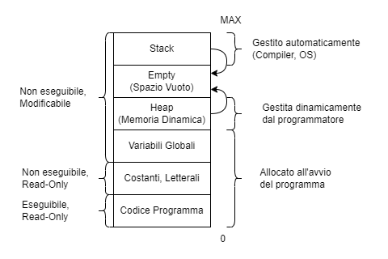
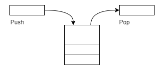
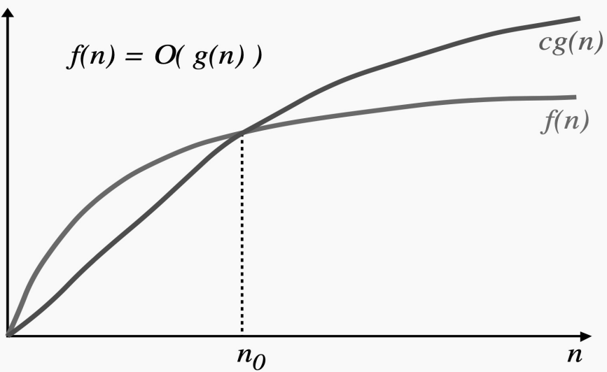
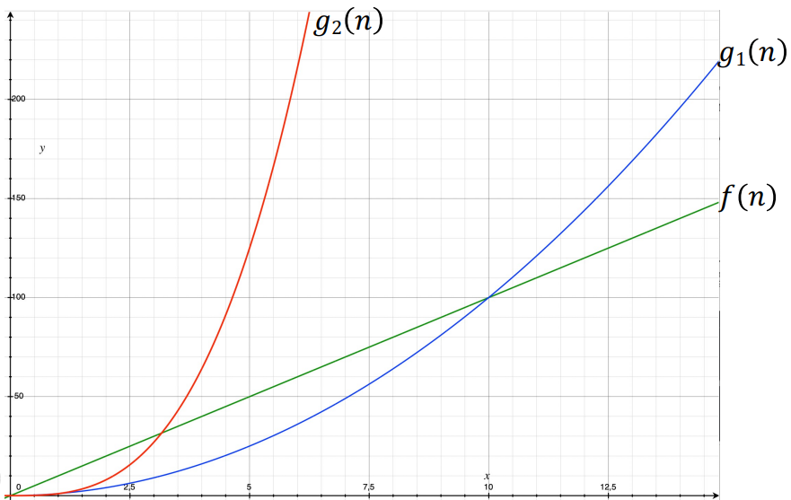
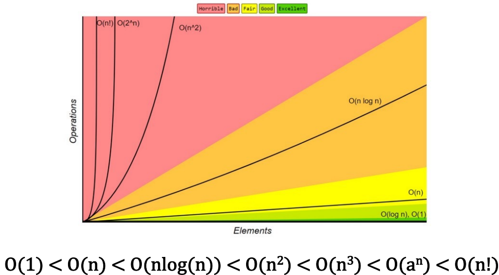
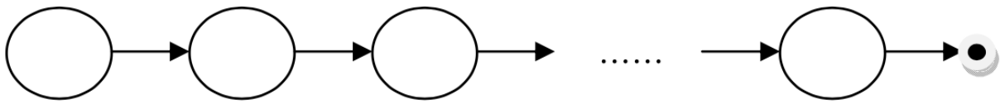
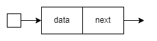

# Teoria programmazione II

## 1 Gestione della memoria

C permette di allocare **dinamicamente** aree di memoria.



### 1.1 Stack

Lo stack (o pila) è una struttura dati di tipo LIFO (Last-In-First-Out).



Viene usato per contenere i record di attivazione:

- zona di memoria contente i parametri formali e le variabili locali di una funzione:
  - quando la funzione viene invocata: il record di attivazione viene creato e inserito (push) nello stack e viene utilizzato dalla funzione per la sua esecuzione;
  - quando la funzione termina: il record di attivazione viene cancellato (pop) dallo stack, liberando la memoria per successivi record di attivazione.

### 1.2 Heap

L’heap è uno spazio di memoria che gestisce le richieste dinamiche di memoria.

Viene gestita da parte dell’utente/programmatore.

Non viene gestita in modo sequenziale:

- l’allocazione di un nuovo elemento viene fatta nel primo spazio idoneo disponibile;
- la deallocazione di una zona di memoria può avvenire in qualunque momento senza un preciso ordine.

## 2 Strutture

Il C mette a disposizione i tipi primitivi, derivati e aggregati.

### 2.1 Struct

> [!NOTE] Struct
>
> Serve per costruire un tipo di dato astratto.

Creazione e dichiarazione di una struttura:

```c
struct NomeStruct {
    Tipo1 Variabile1;
    Tipo2 Variabile2;
    …
    TipoN VariabileN;
};

struct NomeStruct Nome;

// accesso alle singole proprietà
NomeStruct.Variabile1;
```

### 2.2 Typedef

Il typedef serve per rinominare, ad esempio, una struttura dati:

```c
struct nodo {
    int data;
    struct nodo *next;
};

typedef struct nodo Node;
```

### 2.3 Passaggio di struct come parametri a funzioni

Per passare una struct per parametro sarà necessario passare un puntatore alla struttura:

```c
int aus = nomeStruct->data;
```

## 3 Complessità

Non disponiamo di infinito tempo e spazio, infatti il nostro obiettivo è quello di **diminuire i costi**.

Abbiamo due tipi di complessità:

- in **tempo**: tempo richiesto dall'algoritmo;
- in **spazio**: memoria richiesta dall'algoritmo.

I fattori che influenzano la complessità sono:

- **tipologia** di algoritmo;
- **dimensione** dell’**input**;
- **velocità** della **macchina**.

### 3.1 Complessità asintotica

Valuta il costo di esecuzione di un algoritmo in termini asintotici, ovvero per input sufficientemente grandi.

Complessità in tempo: ordine di grandezza del numero di passi/istruzioni richiesti dall'algoritmo.

Complessità in spazio: numero massimo di record di attivazione contemporaneamente sullo stack.

### 3.2 Notazione O-grande

Viene usata per descrivere il comportamento asintotico delle funzioni matematiche.

Date due funzioni $f(n),g(n)$ diremo che $f(n)\in O(g(n))$ se e solo se  

$\exist n_0,\ c>0:\ f(n)<cg(n)\ \ \ \forall n>n_0$

in cui $f(n)<cg(n)$ indica il costo computazionale mentre $\forall n>n_0$ indica la numerosità dell’input. Ciò vale per n molto grande, ovvero per $n\rightarrow + \infin$.



Sia $f(n)=10n$ il costo computazionale di una funzione, siano $g_1(n)=n^2$ e $g_2(n)=n^3$, è chiaro che $f(n)\in O(g_1(n))$ e $f(n)\in O(g_2(n))$.



Classi di complessità:



### 3.4 Analisi complessità in tempo

La complessità si basa su diversi parametri:

- sull'**input**:
    bisogna individuare gli input che possono influenzare la durata dell’esecuzione. Non tutti gli input influenzano la computazione;

- sul **programma**:
    si calcola facendo la $\sum$ del costo computazionale delle singole istruzioni.

    Esistono diverse tipologie di istruzioni:

    1. istruzioni elementari: operazioni aritmetiche, stampa o lettura I/O, lettura/scrittura di variabili, condizioni logiche. Queste istruzioni hanno costo costante;
    2. istruzioni condizionali: if;
    3. istruzioni iterative: for, while, do while.

Esempio con una funzione:

```c
void function(int n, int *value) {
    int i;
    for (i = 0; i < n; i++) { // complessita for: O(n)
        *value += i * i;
        i = i + 1;
    }
    i = 0; // complessita: O(1)
    while (i < 2 * n) { // complessita while: O(n)
        printf("%d\n", *value);
        i += 2;
    }
}
```

 $O(n)$ è la complessità asintotica lineare

La complessità è lineare perché non ci sono cicli annidati.

### 3.5 Analisi complessità in spazio

Si basa sul modello di record di attivazione, ossia il numero massimo dei record di attivazione contemporaneamente sullo stack (non il numero di chiamate).

Per le funzioni iterative avrò $O(1)$, ovvero il numero di variabili presenti nella funzione, che sarà una costante.

Per le funzioni ricorsive, il valore dipende dal numero di chiamate ricorsive (dipendenti dall'input) effettuate.

## 4 Allocazione dinamica memoria

In questa sezione ci troviamo all’interno dell’heap

L’heap è gestito dal programmatore in modo dinamico in run-time.

Ad ogni richiesta si alloca quanto richiesto nel primo blocco di memoria disponibile.

Le allocazioni e deallocazioni non sono eseguite in modo sequenziale, come per lo stack.

### 4.1 Allocazione memoria: malloc()

```c
void * malloc(size_t size);
```

Permette di allocare un blocco di memoria di size bytes.

Il suo input è la dimensione in bytes, l suo output è un puntatore alla zona di memoria allocata. Il tipo è void, starà al programmatore eseguire un cast specifico.

### 4.2 Operatore sizeof()

```c
sizeof(typename)
```

Ottengo la dimensione di un tipo dati typename.

Il suo input è un tipo, il suo output è la dimensione in bytes.

### 4.3 Combinazione malloc/sizeof

Dichiaro un puntatore, alloco lo spazio in memoria, calcolo lo spazio con la sizeof, effettuo un cast e assegno l’indirizzo della memoria allocata a p.

```c
float *p;
p = ( float * ) malloc(sizeof (float));
```

### 4.4 Deallocazione memoria: free()

```c
void free(void *ptr);
```

Dealloco un un blocco di memoria allocato.

Richiede un puntatore come input.

### 4.5 Allocazione memoria: calloc()

```c
void * calloc(size_t count, size_t size);
```

Permette di allocare count oggetti di dimensione size bytes.

Come la malloc ma con n oggetti.

### 4.6 Riallocazione memoria: realloc()

```c
void *realloc(void *ptr, size_t size);
```

Modifica la dimensione di un blocco di memoria precedentemente allocato.

## 5 Liste

> [!IMPORTANT] Lista
>
> 1. una lista vuota è una lista;
> 2. un nodo seguito da una lista è una lista.



Possiamo applicare il punto 2 ripetutamente per ottenere una lista.

Non esiste un tipo primitivo “lista”, però possono essere implementate.

Prendiamo in considerazione le liste dinamiche, possiamo realizzarle con le struct e i puntatori.

Esempio lista:

```c
#include <stdio.h>
#include <stdlib.h>

struct nodo {
    int data;
    struct nodo *next;
};

typedef struct nodo Node;
```



## 6 Visita di una lista

```c
void stampaLista(Node *head) {
    while (head) {
        printf("%d->", head->data);
        head = head->next;
    }
    printf("NULL\n");
}
```

Complessità in tempo: $O(n)$, con n numero di nodi della lista.

Complessità in spazio: $O(1)$.

### 6.1 Visita condizionata

```c
// Dati una lista e un intero k in input, stampa i nodi con valore > k
void print_greater(Node *lis, int k) {
    while (lis != NULL) {
        if(lis->d > k ) {
            printf("%d\n", lis->d);
        }
        lis= lis->next;
    }
}

// Stampa nodi multipli di un intero x
void printpos(Node *lis, int x) {
    int pos=1;
    while (lis != NULL) {
        if ((pos % x)==0) {
            printf(">>>> %d\n", lis->d);
        }
        pos++;
        lis= lis->next;
    }
}
```

## 7 Algoritmi con finestra

Questi algoritmi servono per visitare gruppi di n nodi.

```c
// Calcolare quante volte un elemento è minore del successivo
int elementi_minori(Node *lis) {
    int cnt = 0;

    if (lis == NULL) {
        cnt = 0;
    } else if (lis->next == NULL) {
        cnt = 0;
    } else {
        while (lis->next != NULL) {
            if(lis->d < lis->next->d ) {
                cnt++;
            }
            lis = lis->next;
        }
    }
    return cnt;
}

// Data una lista, restituire in output il numero dei nodi della lista che sono somma dei loro due predecessori immediati
int printsum(Node *lis) {
    int cnt = 0;

    if (lis == NULL) {
        cnt = 0;
    } else if (lis->next == NULL) {
        cnt = 0;
    } else if (lis->next->next == NULL) {
        cnt = 0;
    } else {
        while (lis->next->next != NULL) {
            if(lis->next->next->d==lis->next->d+lis->d) {
                cnt++;
            }
            lis= lis->next;
        }
    }
    return cnt;
}
```

## 8 Ricerca di un elemento

Ci sono due metodi di ricerca:

- per valore;
- per posizione.

### 8.1 Ricerca per valore

```c
// Dato un valore x in input, la ricerca per valore restituisce un puntatore al nodo con valore x in una lista head. Se x non è presente nella lista, restituisce NULL. Se sono presenti più nodi con lo stesso valore x, viene alla prima occorrenza.

Node *ricercaNodoVal(int x, Node *head) {
    int flag = 0;

    while(head && !flag) {
        if(head->data == x) {
            flag = 1;
        } else {
            head = head->next;
        }
    }
    return head;
}
```

### 8.2 Ricerca per posizione

```c
// Data una posizione x in input, la ricerca restituirà un puntatore al nodo di posizione x della lista head. Se x non è presente nella lista, restituisce NULL.

Node *ricercaNodo(int x, Node *head) {
    int pos = 0, flag = 0;

    while(head && !flag) {
        if(x == pos) {
            flag = 1;
        } else {
            head = head->next;
            pos++;
        }
    }
    return head;
}
```

## 9 Modifica, inserimento, cancellazione nella lista

### 9.1 Modifica nodi

```c
// Data una lista in input, modificare il valore di ogni singolo nodo incrementandolo di una unità.

void incrementa(Node *head) {
    while (head) {
        head->data++;
        head = head->next;
    }
}
```

### 9.2 Inserimento nodi

```c
// Inserimento nodo in testa.

void inserimentoTesta(int x, Node **head) {
    Node *temp;
    temp = (Node*) malloc(sizeof(Node));
    temp->data = x;
    temp->next = *head;
    *head = temp;
}

// Inserimento nodo in coda.

void inserimentoCoda(int x, Node **head) {
    Node *temp, *aus; 
    temp = (Node*) malloc(sizeof(Node));
    temp->data = x;
    temp->next = NULL;
    aus = *head;

    if (aus) {
        while(aus->next) {
            aus = aus->next;
        }
        aus->next = temp;
    }
}
```

### 9.3 Cancella nodi

```c
// Rimuovere il primo valore della lista.

void removeFirst(Node **head) {
    Node *temp = NULL;

    if(head == NULL) {
        exit(1);
    }
    if(*head != NULL) {
        temp = *head;
        *head = temp->next;
        free(temp);
    }
}

// Rimuovere l’ultimo valore della lista.

void removeLast(Node **head) {
    Node *temp = NULL, *prev = NULL;

    if(head == NULL) {
        exit(1);
    }
    if(*head != NULL) {
        temp = *head;
        while(temp->next != NULL) {
            prev = temp;
            temp = temp->next;
        }
        free(temp);
        prev->next = NULL;
    }
}

// Distruzione lista.

void removeList(Node **head) {
    Node *temp = NULL;

    while(*head != NULL) {
        temp = *head;
        *head = temp->next;
        free(temp);
    }
    *head = NULL;
}

// Rimuovere tutti i nodi con valore x.

void removeValue(Node **head, int x) {
    if(head == NULL) {
        return;
    }

    Node *temp = *head, *prev = NULL;

    while(temp != NULL) {
        if(temp->data == x) {
            if(prev == NULL) {
                *head = temp->next;
                free(temp);
                temp = *head;
            } else {
                prev->next = temp->next;
                free(temp);
                temp = prev->next;
            }
        } else {
            if(prev == NULL) {
                prev = *head;
            } else {
                prev = prev->next;
            }
            temp = temp->next;
        }
    }
}
```

## 10 Operazioni su più liste

```c
// Il seguente esercizio mostra come dividere una lista in due lasciando da un lato i nodi pari e dall’altro i nodi dispari.

void suddividiLista(Node **head, Node **pari, Node **dispari) {
    if(*head == NULL) {
        return;
    }
    Node *tailPari = NULL, *tailDispari = NULL, *aus = NULL, *temp = *head;
    *pari = NULL;
    *dispari = NULL;
    while(temp != NULL) {
        aus = (Node*) malloc(sizeof(Node));
        if (aus == NULL) {
            printf("Impossibile allocare memoria.\n");
            return 0;
        }
        aus->data = temp->data;
        aus->next = NULL;
        if(temp->data % 2 == 0) {
            if(*pari == NULL){
                *pari = aus;
            } else {
                tailPari->next = aus;
            }
            tailPari = aus;
        } else {
            if(*dispari == NULL) {
                *dispari = aus;
            } else {
                tailDispari->next = aus;
            }
            tailDispari = aus;
        }
        temp = temp->next;
    }
}

// Duplicazione di una lista.

Node *duplicaLista(Node *head) {
    Node *headList2 = NULL, *tail = NULL;

    while(head != NULL) {
        Node *temp = NULL;
        temp = (Node*) malloc(sizeof(Node));
        if(temp == NULL) {
            perror("errore");
            exit(1);
        }
        temp->data = head->data;
        temp->next = NULL;

        if(headList2 == NULL) {
            headList2 = temp;
        } else {
            tail->next = temp;
        }
        tail = temp;
        head = head->next;
    }
    return headList2;
}
```

## 11 Introduzione ricorsione

Una funzione si dice ricorsiva se:

- all’interno della funzione è presente una chiamata alla funzione stessa;
- è presente nel codice della funzione un’altra procedura o funzione che, direttamente o indirettamente, richiama la funzione.
- Esempio con il fattoriale .

    Approccio iterativo:

    ```c
    int fattoriale(int n) {
        int somma = 1;
    
        for (int i = 1; i <= n; i++) {
            somma *= i;
        }
        return somma;
    }
    ```

    Approccio ricorsivo:

    ```c
    int fattoriale(int n) {
        if(n == 0) {
            return 1;
        } else {
            return n * fattoriale(n-1);
        }
    }
    ```

- Esempio Fibonacci .

    Casi possibili:

    $f(n) = \left\{ \begin{array}{rcr}0 & se & n=0\\1 & se & n=1\\f(n-1)+f(n-2)& altrimenti & \end{array}\right.$

    Approccio ricorsivo:

    ```c
    int fibonacci(int n) {
        if(n == 0) {
            return 0;
        } else if(n == 1) {
            return 1;
        } else {
            return (fibonacci(n - 1) + fibonacci(n - 2));
        }
    }
    ```

- Approccio iterativo .

    ```c
    int fibo_iter(int n) {
        int fib = 1, i, fibminus1, fibminus2;
        
        if (n == 0 || n == 1) {
            fib = n;
        } else {
            fibminus2 = 0;
            fibminus1 = 1;
            for (i=2; i <= n; i++) {
                fib = fibminus1 + fibminus2;
                fibminus2 = fibminus1;
                fibminus1 = fib;
            }
        }
        return fib;
    }
    ```

### 11.1 Esempi di funzioni ricorsive

**Somma**:

Calcoliamo la somma di due numeri positivi utilizzando solo l’incremento di 1.

$x+y=x+1+1+\dots+1$ sommato $y$  volte.

```c
int somma(int x, int y) {
    if(y == 0) {
        return x;
    } else {
        return 1 + somma(x, y - 1);
    }
}
```

**Prodotto**:

Funzione che calcola il prodotto di due numeri positivi utilizzando solo l’operatore di somma.

$x*y=x+x+x+\dots+x$ sommato $y$ volte.

```c
int prodotto(int x, int y) {
    if(y == 0) {
        return 0;
    } else {
        return x + (prodotto(x, y - 1));
    }
}
```

**Elevamento a potenza**:

Funzione che calcola l’elevamento a potenza utilizzando solo l’operatore di prodotto.

 $x^y=x*x*x*\dots*x$ moltiplicato $y$ volte.

```c
int potenza(int x, int y) {
    if(y == 0) {
        return 1;
    } else {
        return x * (potenza(x, y - 1));
    }
}
```

**Divisione intera**:

Funzione che calcola la divisione intera tra due numeri interi usando solo l’operatore di somma.

$\frac x y=k+r\rightarrow x=k*y+r$ vogliamo calcolare $k$.

```c
int divisioneInt(int x, int y) {
    if(x < y) {
        return 0;
    } else {
        return 1 + divisioneInt(x - y, y);
    }
}
```

**Resto divisione**:

Funzione che calcola il resto (mod) tra due numeri interi usando solo l’operatore di differenza.

$\frac x y=k+r\rightarrow x=k*y+r$ vogliamo calcolare $r$.

```c
int divisioneRest(int x, int y) {
    if(x < y) {
        return x;
    } else {
        return divioneRest(x - y, y);
    }
}
```

**Somma valori array**:

```c
int somma(int arr[], int n) {
    if(n == 0) {
        return arr[n];
    } else {
        return arr[n] + somma(arr, n - 1);
    }
}
```

**Stampa valori array**:

```c
int stampa_Ric(int arr[], int pos, int n) {
    if(n >= pos) {
        printf("%d, ", arr[pos]);
        return stampa_Ric(arr, pos + 1, n);
    } 
}
```

**Restituire il minimo di un array**:

```c
int minArr(int arr[], int n) {
    if(n == 0) {
        return arr[0];
    } else {
        return min(arr[n], minArr(arr, n - 1));
    }
}

int min(int a, int b) {
    return (a < b) ? a : b;
}
```

**Trovare un elemento all’interno di un array**:

```c
int cercaPosVal(int arr[], int n, int x) {
    if(n < 0) {
        return -1;
    } if(arr[n] == x) {
        return n;
    } else {
        return cercaPosVal(arr, n - 1, x);
    }
}
```

**Dividere tutte le occorrenze multiple di un dato valore per x**:

```c
void divOcc(int arr[], int n, int x) {
    if(n >= 0) {
        if(arr[n] % x == 0) {
            arr[n] /= x;
        }
        divOcc(arr, n - 1, x);
    }
}
```

**Contare le occorrenze di x nell’array**:

```c
int contaOcc(int arr[], int n, int x) {
    if(n < 0) {
        return 0;
    } else if(arr[n] == x) {
        return 1 + contaOcc(arr, n - 1, x);
    } else {
        return contaOcc(arr, n - 1, x);
    }
}
```

## 12 Torre di hanoi

## 13 Tipi di ricorsione

## 14 Ricorsione su più liste

## 15 Mergesort

## 16 Quicksort

## 17 Pile e code
