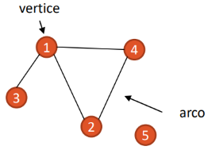
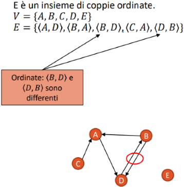

# Algoritmi II

## 1 Grafi e viste

> [!IMPORTANT] Grafo
> Coppia $G=(V,\ E)$ che consiste in due insiemi:
>  
> - $V$ di vertici (o nodi);
> - $E\ (E \subseteq V\ \text{x}\ V)$ di coppie di vertici, detti archi: ogni arco connette due vertici.

Ad esempio: $V=\{\text{persone}\}$, $E=\{\text{coppie di persone che si conoscono}\}$.

### 1.1 Grafi orientati e non orientati

La **prima distinzione** tra i grafi è se hanno **relazioni**:

- **simmetriche**, quindi un grafo non orientato:
  

- **asimmetriche**: grafo orientato:

### 1.2 Incidenza e grado grafo

> ![IMPORTANT] Arco incidente
>
> Sia l'arco $(v,w)$ o $\langle v,w\rangle \in E$, è incidente sui vertici $v$ e $w$.

• I concetti di incidenza ed adiacenza (grado di un arco)
• Cos’è un cammino (lunghezza di un cammino, cammini semplici)
• Grafo pesato
• Raggiungibilità
• Grafo connesso (fortemente, debolmente)
• Cicli (grafo aciclico, DAG)
• Grafo completo
• Teorema di Gauss bambino e sue applicazioni
• Alberi liberi, radicati e foreste
